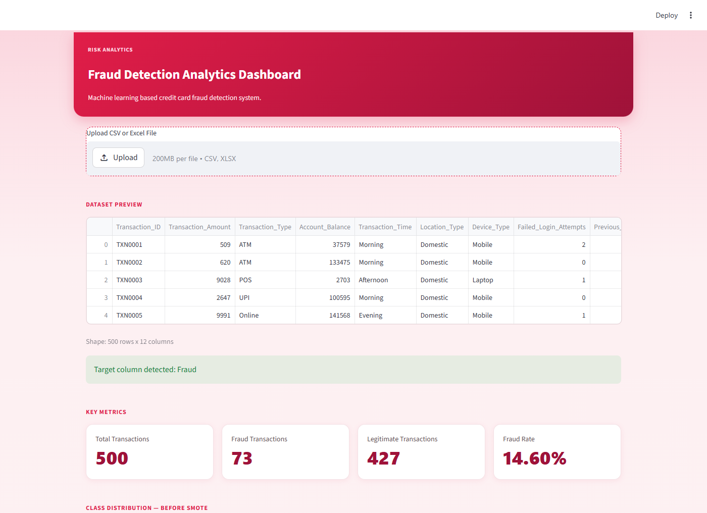
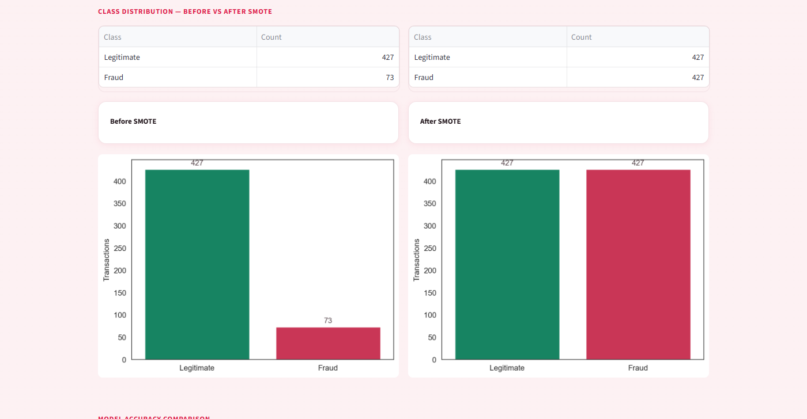
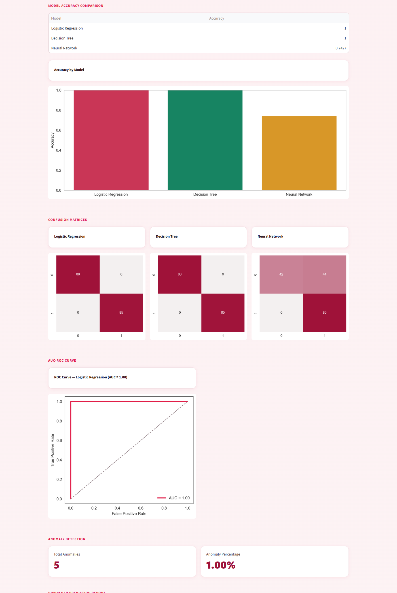

# Fraud Detection System

Flags suspicious credit card transactions using two complementary views:
supervised classifiers trained on labelled fraud, and unsupervised anomaly
detection that looks for transactions that simply don't fit the pattern.
Everything is exposed through a Streamlit dashboard.

Python · Scikit-learn · TensorFlow · imbalanced-learn · Streamlit

> Built during my Data Science internship at Codec Technologies (May – June 2025).

## The problem

Fraud is rare — which is exactly what makes it hard. A model can reach high
accuracy by labelling every transaction as legitimate and still miss every
fraud case. This project handles the imbalance explicitly and adds an
unsupervised check that doesn't depend on labels at all.

## Approach

```
Transactions ─► detect label column ─► scale ─┬─► SMOTE ─► train/test split ─► LR · Decision Tree · MLP ─► ROC & confusion matrices
                                              └─► Isolation Forest (no labels needed) ─► anomaly flags
```

- **Supervised:** Logistic Regression, Decision Tree and a Neural Network (MLP), compared with confusion matrices, plus a ROC curve and AUC for Logistic Regression
- **Unsupervised:** Isolation Forest in the dashboard; the notebook also explores a TensorFlow/Keras **autoencoder** for reconstruction-error based anomaly detection
- **Imbalance:** SMOTE oversampling, with before/after distribution charts

## Features

- **Upload a CSV/Excel file**, or use the bundled 500-transaction sample
- **Automatic target detection** for common label columns (`Class`, `Fraud`, `label`, `target`)
- **KPI cards** — total transactions, fraud count, legitimate count, fraud rate
- **Model comparison** and **ROC curve**
- **Anomaly view** from Isolation Forest, independent of the labels
- **Excel export** of per-transaction predictions and probabilities

## Screenshots

| Dashboard overview |
| --- |
|  |

| Class balancing (SMOTE) |
| --- |
|  |

| Model comparison, ROC curve & anomaly detection |
| --- |
|  |

## Tech stack

| Area | Tools |
|---|---|
| Data | Pandas, NumPy |
| Modelling | Scikit-learn, imbalanced-learn (SMOTE), TensorFlow/Keras (notebook) |
| Visualisation | Matplotlib, Seaborn |
| App & export | Streamlit, Excel export |

## Run it locally

```bash
git clone https://github.com/SobhanaAishwarya/Fraud-Detection-System.git
cd Fraud-Detection-System
pip install -r requirements.txt
streamlit run app.py
```

Leave the uploader empty to use the bundled sample dataset.

## Repository layout

| File | Purpose |
|---|---|
| `app.py` | Streamlit dashboard — the full pipeline runs on each upload |
| `fraud_detection_system.ipynb` | Notebook with the full analysis, including the autoencoder |
| `fraud_model.pkl` / `scaler.pkl` | Model and scaler saved from the notebook |
| `fraud_detection_dataset_500.csv` | Sample dataset (500 labelled transactions) |

## Possible next steps

- Resample with SMOTE on the training split only, so synthetic samples never reach the test set
- Report precision, recall and PR-AUC for every model, not only accuracy
- Tune the decision threshold for the cost of a missed fraud vs. a false alarm
- Bring the autoencoder into the dashboard next to Isolation Forest

---

© 2026 Kantapalli Sobhana Aishwarya. All rights reserved. Shared for portfolio viewing; please ask before reusing.
